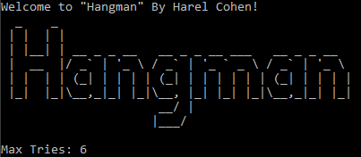
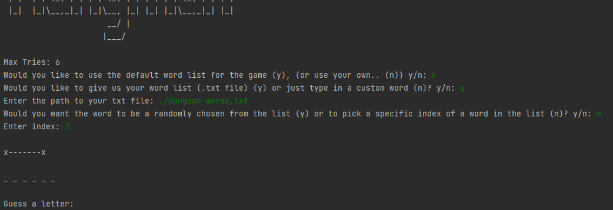
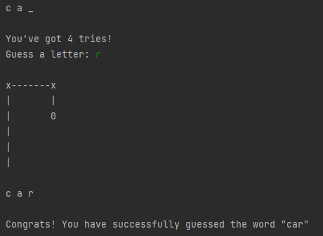
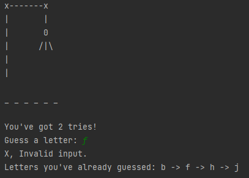
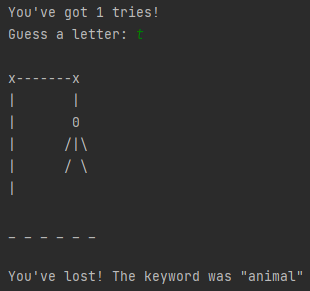

# Harel Cohen Self Py Hangman Mini-Project
### משחק איש תלוי – פייתון

את משחק זה פיתחתי במהלך הקורס Self.py של קמפוס IL.\
המשחק כתוב כולו בפייתון ומציג לשחקן מספר דרכים שונות להתחיל לשחק: לתת למשחק לבחור מילה רנדומלית מן רשימת המילים הדיפולטיבית המגיעה עם המשחק (*אם מחליפים את הנתיב של הקובץ והוא לא באותה תיקייה יש לשנות זאת גם בקוד או פשוט לבחור אופציה אחרת לבחירת המילה), לבחור אינדקס של מילה ספציפית ברשימת המילים הדיפולטיבית, לטעון את רשימת המילים שלך או פשוט להקליד מילה שתהיה מילת המפתח של המשחק.\
לאחר שנבחרה מילת המפתח בכל דרך שהיא, מטרה השחקן הינה למצוא את המילה המסתורית תוך כמה שפחות ניסיונות, לפני שהאיש נתלה לגמרי, כל ניחוש שגוי גורם לאיש להיתלות עוד קצת.

  

#### Menu and keyword selection

#### Winner Screen

#### Invalid Input (guessing the same letter twice)

#### Losing Screen
